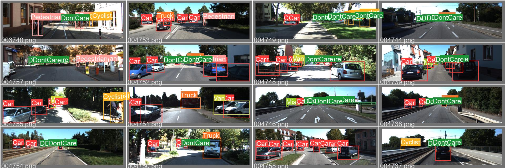
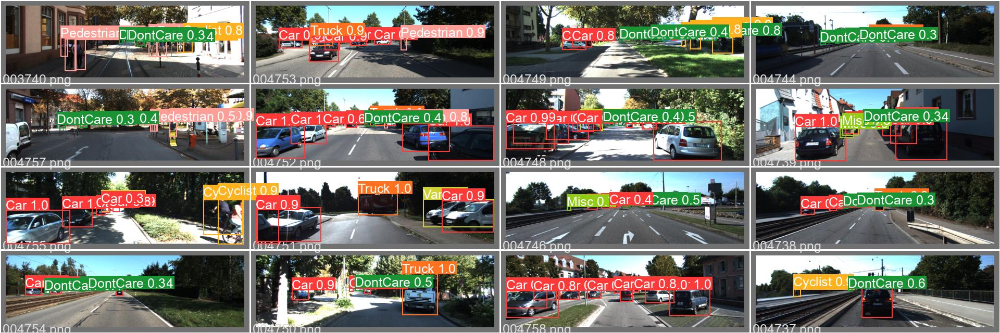
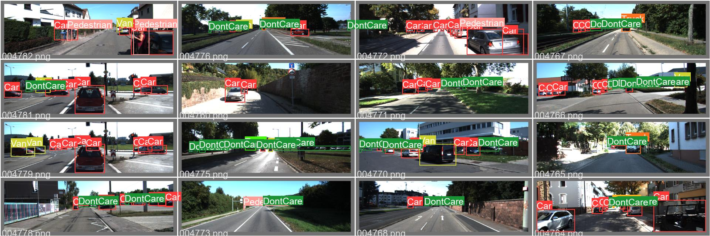
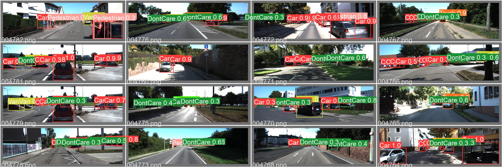
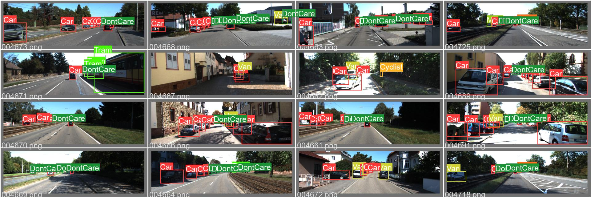
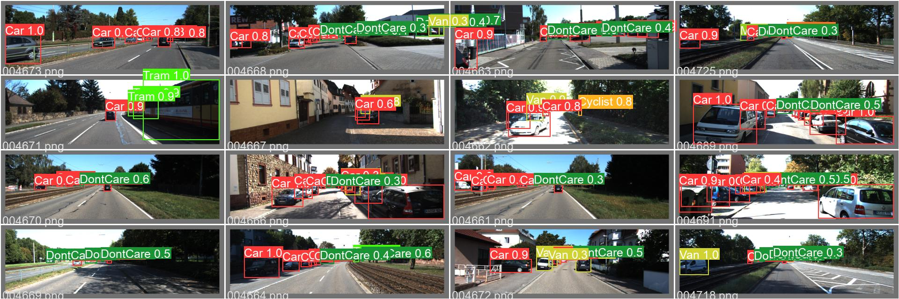
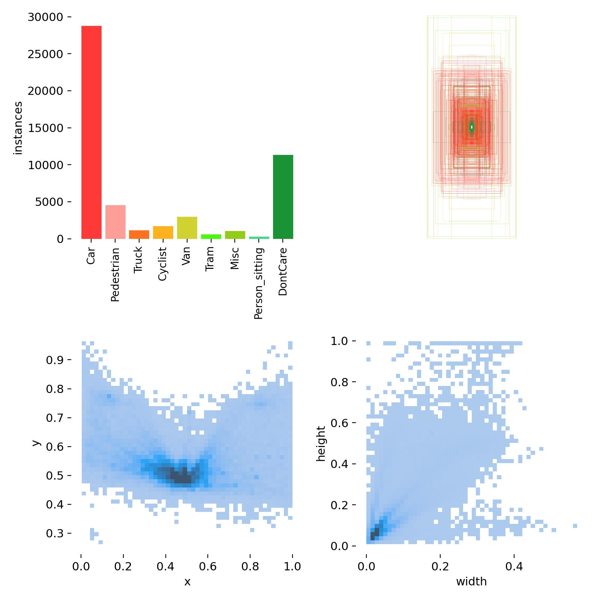
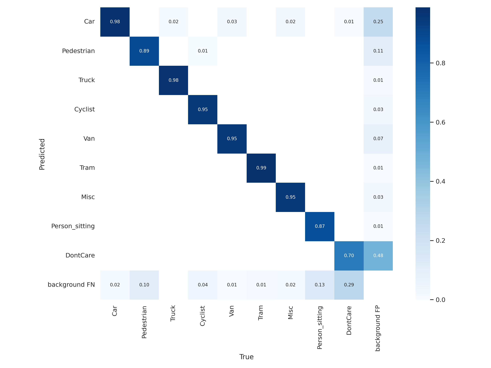

# yolov5 1차 자료

```bash
# YOLOv5 모델 가져오기
$ git clone https://github.com/ultralytics/yolov5.git
```

```bash
# KITTI 전체 데이터 학습 (YOLOv5s 모델)
$ python train.py --img 640 --batch 16 --epochs 300 --data kitti.yaml --weights yolov5s.pt
```

라벨 1



val pred 1



라벨 2



val pred 2



label 3



val pred 3






