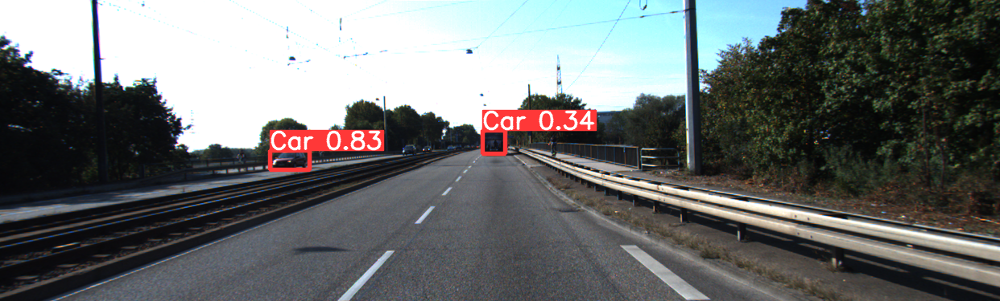

# yolov5 2차 실험

- 가설 및 목표 : bbox 라벨링 성능 비교 (보이는 부분만 vs 보이지 않는 부분까지), 2가지 버전으로 모델 학습
- 이미지 인풋 사이즈 : 640
- 배치 사이즈 : 16
- 모델 : YOLOv5s
- 에포크 : 100
- 데이터 종류 : KITTI
- 데이터 개수 : 각각 200개씩
- 데이터 변형여부 :
  - 버전 1)
    - occluded 1이상 객체가 있는 이미지 100개 : 원본처럼 가려진 부분도 라벨링, occlusion 0은 이미지에서 제외
    - occluded 0 객체만 있는 이미지 100개

  - 버전 2)
    - occluded 1이상 객체가 있는 이미지 100개 : 보이는 부분만 bbox 라벨링, occlusion 0은 이미지에서 제외
    - occluded 0 객체만 있는 이미지 100개
- 테스트 데이터 : KITTI 데이터 중 occlusion 객체가 있으면서 훈련 데이터셋과 중복되지 않는 100개에 대해 예측(시각화된 bbox를 정성적으로 판단)
- 결과 : 
  - 보이는 부분만 라벨링한 모델에서는 occlusion이 있는 경우 보이는 부분만 bbox로 검출 잘하는 듯해 보임
  - 전체 라벨링(원본)한 모델에서는 occlusion 0인 clean한 객체에 대해서 의외로 검출을 못하는 듯 보였음

   

### 전체 bbox 학습한 결과(에포크 100, 데이터 200장)

  
### 보이는 부분만 bbox

