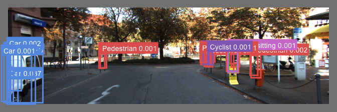
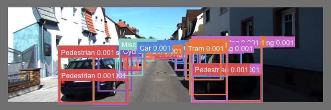
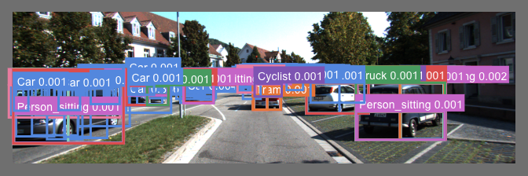

# yolov5 3차 실험

- 가설 및 목표 : occlusion 0인 자동차 객체들 bbox 라벨에 50% crop 버전들 4개 추가로 가려진 자동차 검출 개선
- 이미지 인풋 사이즈 : 640
- 배치 사이즈 : 16
- 모델 : YOLOv5s
- 에포크 : 197(중간에 끊김)
- 데이터 종류 : KITTI
- 데이터 개수 : 7481
- 데이터 변형 여부 :
  - Occlusion 0인 객체 중 ‘Car', 'Van', 'Truck’ 라벨을 가진 객체는 해당 라벨 중 bbox 정보를 통해 상하좌우 각각 50% 버전을 만들어 총 4개의 객체 라벨을 추가함
    - 예 : Car 0.80 0 -2.09 1013.39 182.46 1241.00 374.00 
          → Car 0.80 0 -2.09 1013.39 182.46 1241.00 374.00 
            Car 0.80 4 -2.09 1013.39 182.46 1127.195 374.00 
            Car 0.80 4 -2.09 1127.195 182.46 1241.00 374.00 
- 테스트 데이터셋 : 없음 (그냥 val = train으로 진행후 해당 데이터셋에 예측. 시각화된 bbox를 놓고 정성적으로 판단)
- 결과 :
    1. 클래스 확률이 거의 0.001 수준으로 낮음
    2. mAP는 높은데 예측된 객체의 클래스는 정확하지 않은 경우도 많은 것 같음
    3. 무엇보다 한 객체를 잘게 잘게 쪼개서 여러 개 bbox가 쳐진 예측 결과가 많음
- 학습 및 예측 결과 링크 : [wandb](https://wandb.ai/kshhhhh91/YOLOv5/reports/Shared-panel-22-05-19-10-05-36--VmlldzoyMDM0Njky?accessToken=9o3dzz8nkxxbc4j8j6obinenca4cae3reeh490i5w1a4tll0mbhl4q7ppas0d7om)

### 예측 결과

.png)

