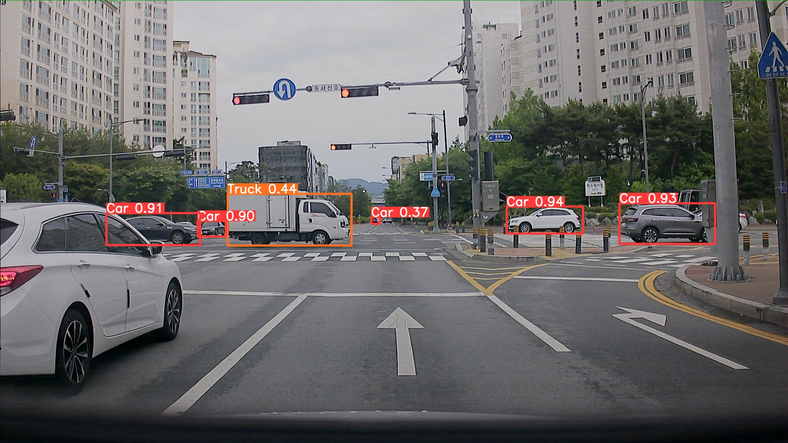

# yolov5 4차 실험

- 가설 및 목표 : 더 큰 화질, 좀 더 큰 모델에서 돌렸을 때 성능 확인
- 이미지 인풋 사이즈 : 1280
- 배치 사이즈 : 16
- 모델 : YOLOv5s6
- 에포크 : 150
- 데이터 종류 : KITTI
- 데이터 개수 : 6481
- 데이터 변형 여부 : 3차와 동일
- 테스트 데이터셋 : train에서 1000개 앞쪽 번호부터 떼어옴
- 결과 : 
    1. bbox 측면에서 한 객체를 쪼개서 예측함
    2. PR_curve에서 bbox 쪼갠 class들(Car, Truck, Van)의 점수가 낮음
    3. 라벨링 되지 않은 작은 객체까지 탐지했는지는 미지수
    4. 판교 자율주행 데이터셋에 예측했을 때의 결과는 ‘가까이 있는 큰 객체 탐지 잘 못함’, ‘특히 porter 트럭 잘 탐지 못함’, ‘잘게 쪼개져서 예측하는 게 덜 하지만 아직 남아있음’
- 학습 및 예측 결과 링크 : [wandb](https://wandb.ai/yj_synstealer/YOLOv5/runs/1kjut4z2?workspace=user-synstealer)

### KITTI에 대한 label & val pred

### 학습 시 bbox 쪼갠 것들만 수치가 낮게 나온 PR curve

### aihub 데이터에 대한 예측 결과

