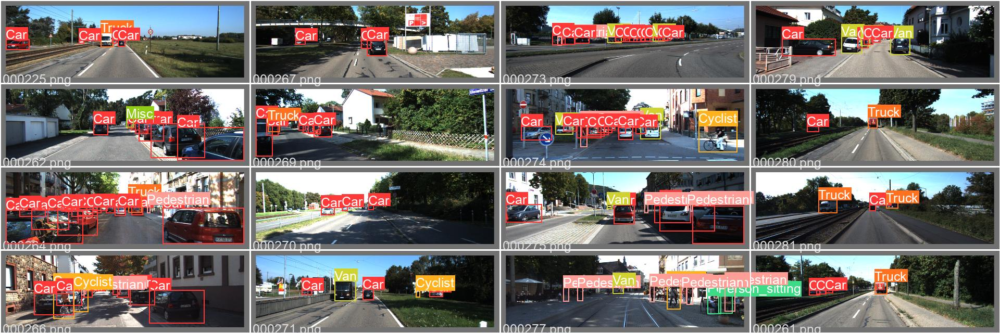
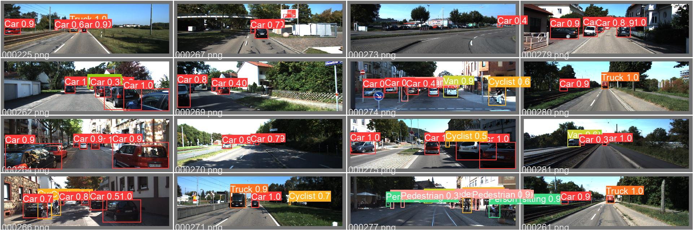
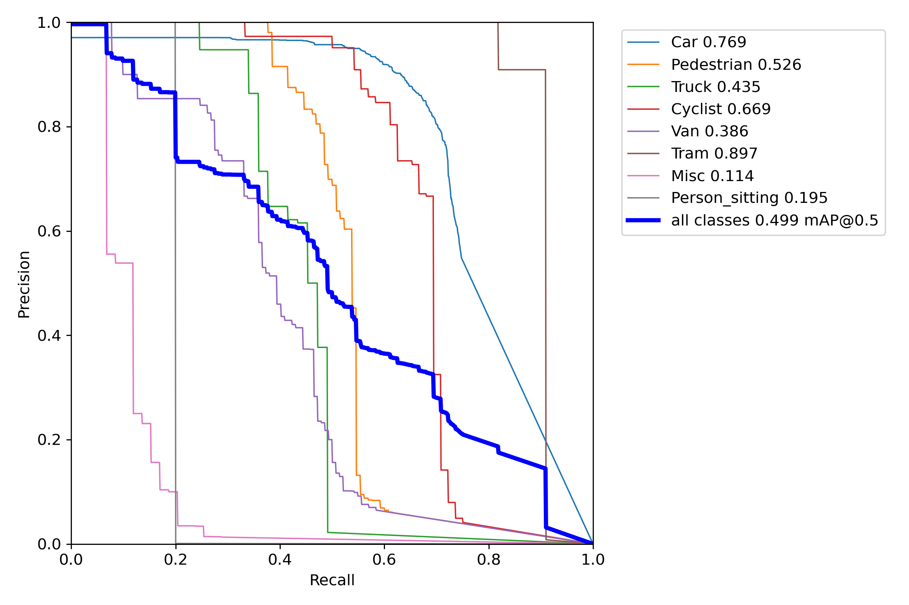
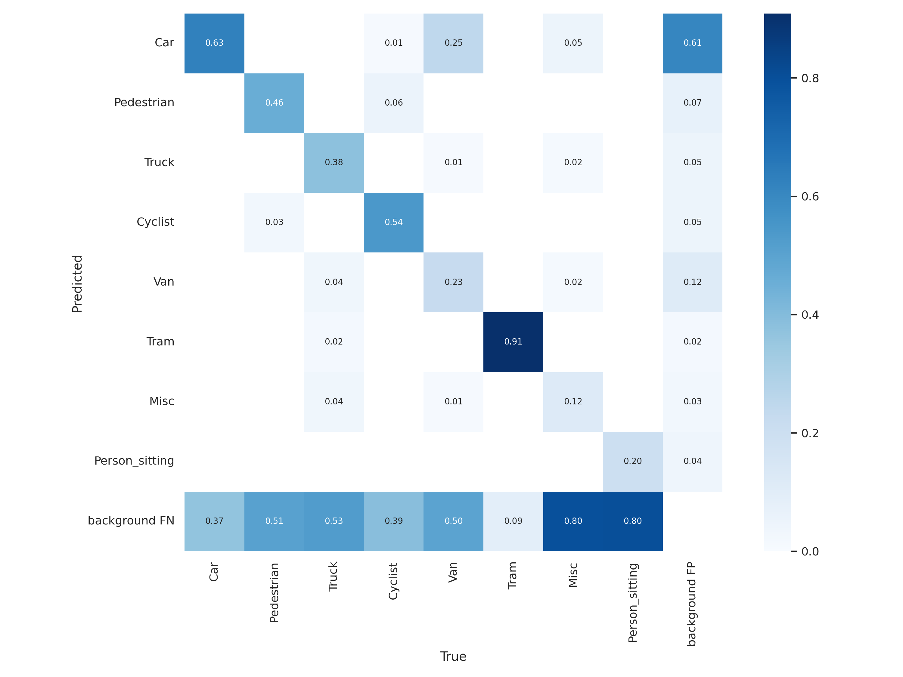
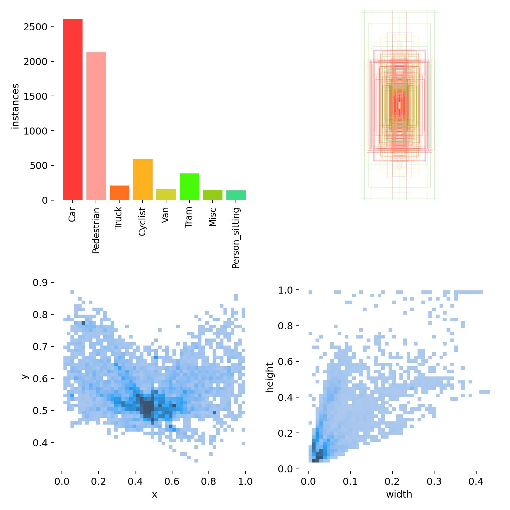
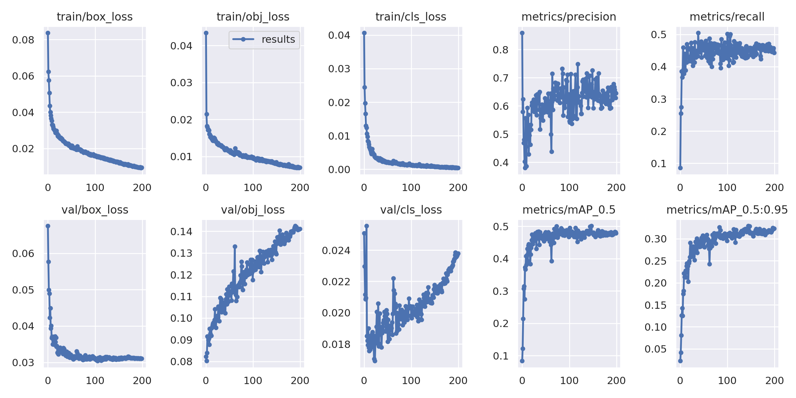

# yolov5 5차 실험

- 가설 및 목표 : Occusion 0인 자동차 객체만 있는 이미지만 추려서 occlusion 없는 데이터로 학습 시 어떤 결과가 나오는지 확인한다.
- 이미지 인풋 사이즈 : 1280
- 배치 사이즈 : 18
- 모델 : YOLOv5s6
- 에포크 : 200
- 데이터 종류 : KITTI
- 데이터 개수 : 2388
- 데이터 변형 여부 : Occlusion 1 이상인 ‘Car', 'Truck’ 'Van’ 객체가 있는 이미지면 학습 데이터에서 제외함
- 테스트 데이터셋 : 나머지 중 섞어서 300개
- 결과 :
  - Occlusion 있는 객체들은 잘 잡아내지 못함
  - Class imabalance(예 : person_sitting 등)으로 인해 Car class를 제외한 나머지에서는 Background False Negative 가 높음(해석 : 실제로는 Person_sitting인데, 그것을 잡아내지 못함)
- 학습 및 예측 결과 링크 : [wandb](https://wandb.ai/yj_synstealer/YOLOv5/runs/36n8mz28?workspace=user-synstealer)

### label 및 val pred

### PR curve

