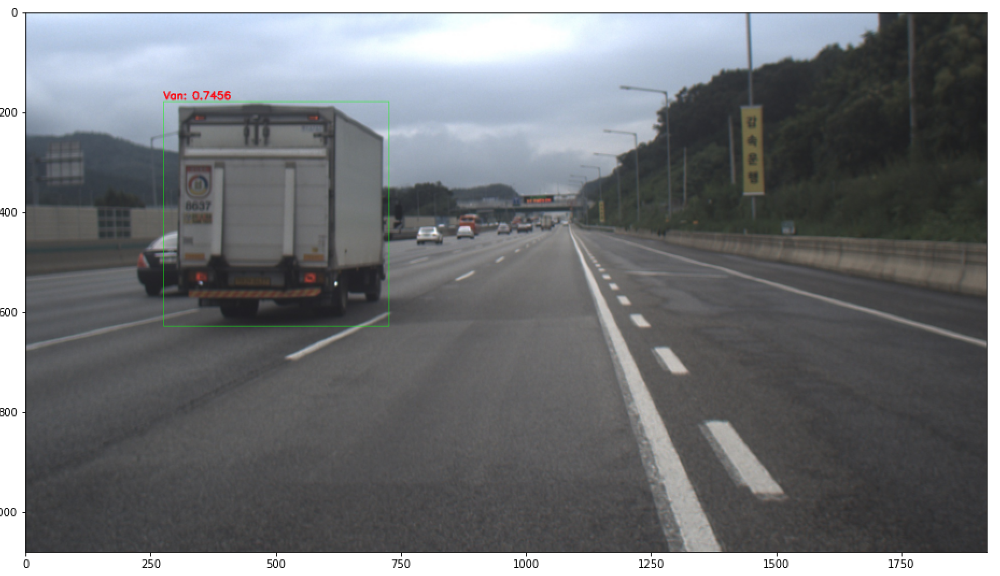
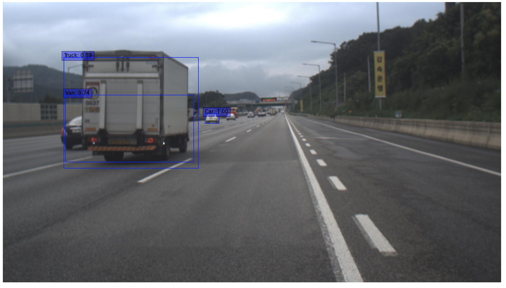
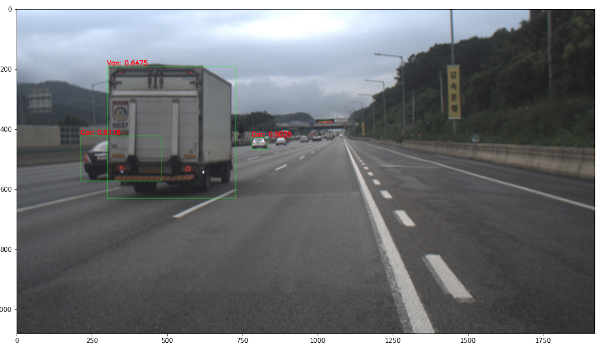
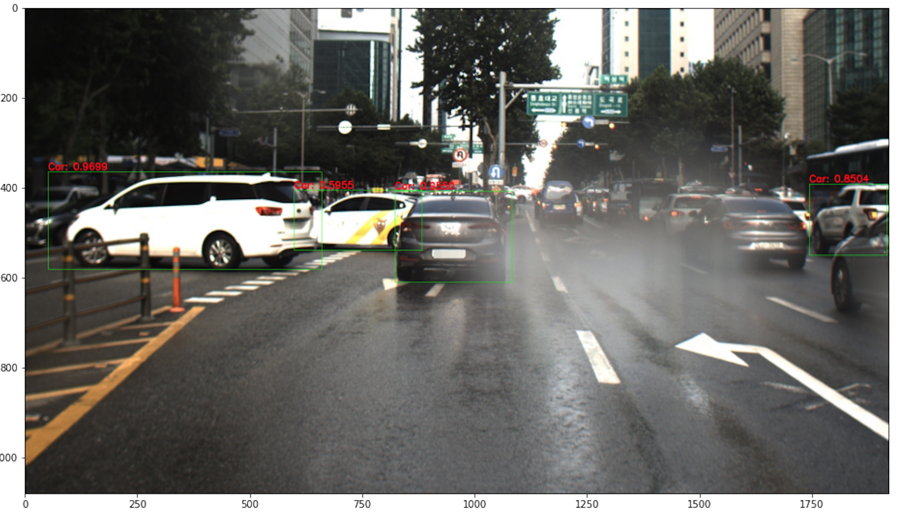
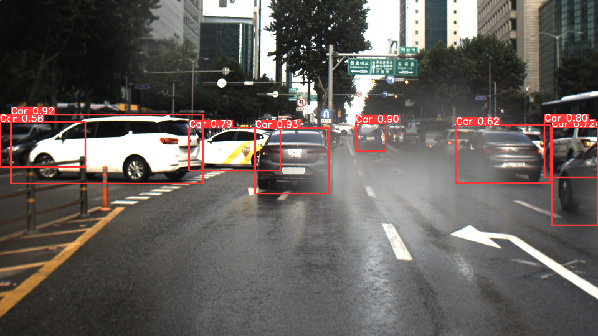
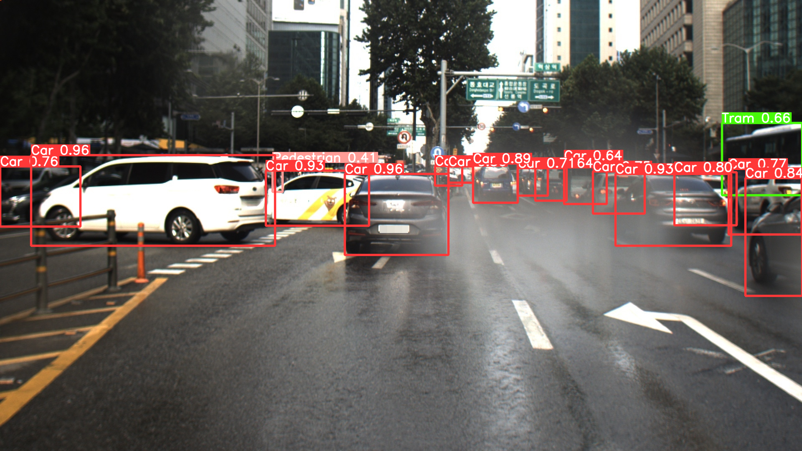
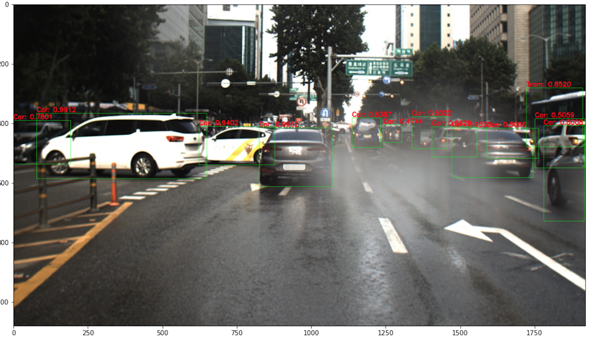
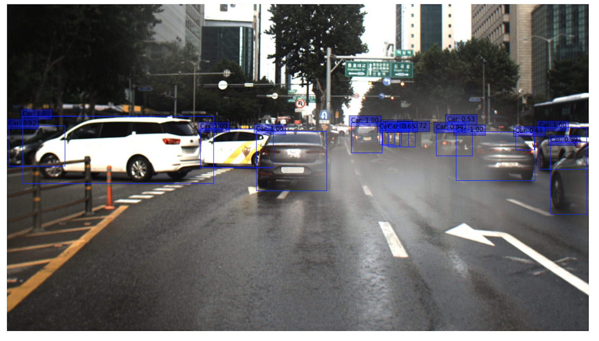

# 정성 평가

||YOLOv5|EfficientDet|RetinaNet|
|:-:|:-:|:-:|:-:|
|kitti_3000||||
|kitti_vkitti||||
|kitti_aihub||||
|kitti_all||||

  
||YOLOv5|EfficientDet|RetinaNet|
|:-:|:-:|:-:|:-:|
|kitti_3000||||
|kitti_vkitti||||
|kitti_aihub||||
|kitti_all||||
